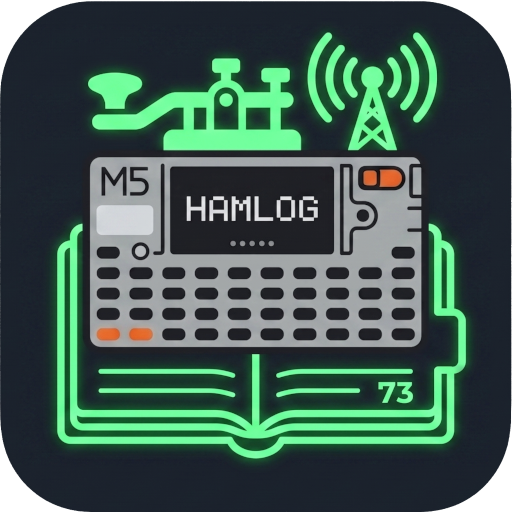
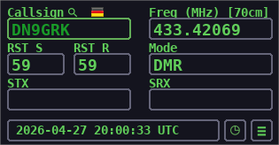

<p align="center">
  
</p>
<h1 align="center">CardputerHamLog</h1>

A portable and lightweight ham radio logging application designed for the M5Stack Cardputer.

**⚠️ Work in Progress ⚠️**

This project is currently in a pre-release, development phase, primarily targeting the upcoming **Cardputer Zero** from M5Stack. It runs in a simulated PC window for development and feature testing. Once the actual hardware is available, the application will be adapted for its specific screen and keyboard.

---

## Screenshot

<p align="center">
  
</p>

---

## Features

### Core Logging
- **QSO Entry**: Log essential contact data including Callsign, Frequency (MHz), RST (Sent/Received), and Mode.
- **Automatic Band Detection**: The band is automatically determined from the entered frequency.
- **Time Management**: QSO time defaults to the current UTC time but can be manually set for any date and time.
- **Dupe Checking**: Callsigns already in the log are highlighted.
- **Callsign Flags**: Automatically displays the country flag next to the callsign prefix. (available offline)

### Special Operation Modes
Toggle between different modes to add relevant fields to the logging screen.
- **SOTA Mode**: Fields for `My SOTA Ref` and the contacted `SOTA Ref`.
- **POTA Mode**: Fields for `My POTA Ref` and the contacted `POTA Ref`.
- **Contest Mode**: Fields for serial numbers (`STX`/`SRX`), with automatic incrementing of your sent serial number (`STX`) after each logged contact.

### Callsign Lookup
- **Providers**: Integrated support for `HamDB` (no credentials needed) and `QRZ.com` (free account required).
- **Security**: QRZ.com Password is stored encrypted to ensure user credential safety.
- **Automatic & Manual Lookup**: Can be configured to automatically fetch callsign data upon logging a QSO, or triggered manually.
- **Data Integration**: Fetched data (Name, QTH, Grid, etc.) is displayed and can be saved with the QSO to the ADIF log.

### Log Management & Statistics
- **Log Viewer**: Browse your entire log history within the app, sorted from newest to oldest.
- **Detailed View**: Select any QSO in the log to see all of its recorded details.
- **Statistics**: Visualize your operating habits with a "Band Distribution" chart showing QSO counts per band.

### Data Export
- **ADIF Format**: All logs are saved in a standard `.adi` file.
- **Flexible Export**: Export all of today's QSOs with a single click, or select a specific date to export.

### Customization
- **Station Configuration**: Set your station's callsign, grid square, default TX power, and CQ/ITU zones.
- **Full Theming**: Every color in the UI is customizable, from the background and text to highlights, popups, and scrollbars.
- **Multi-Language Support**: The UI is available in multiple languages.

## Supported Languages

- English
- Deutsch (German)
- 简体中文 (Simplified Chinese)
- Nederlands (Dutch)
- Español (Spanish)
- Português (Portuguese)
- Italiano (Italian)

## Getting Started (Development Mode)

This application is built with Python and `pygame`.

1.  **Install Dependencies**:
    ```bash
    pip install pygame cryptography
    ```
2.  **Run the Application**:
    To run the logger in a simulated window on your PC, use the `--dev` flag.
    ```bash
    python main.py --dev
    ```

### How It Works

- **Navigation**: Use the `Arrow Keys` to move between input fields and menu items. `Enter` confirms a selection or action, and `Escape` goes back or exits.
- **Configuration**: On first run, a `config.txt` file is created. This file stores all your settings, including station details, theme colors, and language preference.
- **Log File**: QSOs are saved to the ADIF file specified in the settings (default is `hamputer_adif_log.adi`).
- **State**: The application remembers the last used frequency, mode, and other session data in `session.gurk` to make your next startup faster.

## Future Plans

- Adapt UI and input handling for the final M5Stack Cardputer Zero hardware.
- Implement direct hardware control (e.g., screen brightness, power management, hotkeys, battery).
- Further expand statistics and analytics features.